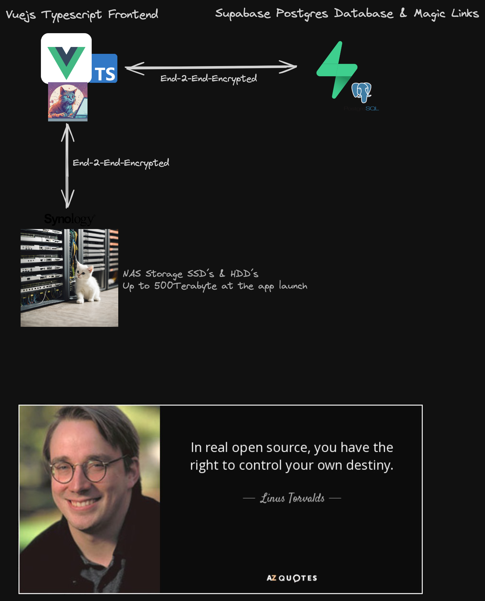

<h2 align="center">Linky-Cloud</h2>

  

Introducing Linky Cloud, the ultimate solution for secure, cloud-based management of your links, contacts, and passwords. Our platform ensures that your data remains safe and accessible with state-of-the-art encryption technology. Linky Cloud offers a comprehensive suite of features, including encrypted file uploads for digital and private key backups, making it the perfect choice for individuals and businesses prioritizing security. Trust Linky Cloud to protect your most valuable information with unmatched reliability and convenience.

<a href="https://linkycloud.com">https://linkycloud.com</a>

 

---

 

## Info

Please note that not all features are implemented so far and keep in mind that this software is still in development (beta testing) and may contain bugs or have limited functionality. Your feedback and suggestions are greatly appreciated. If you encounter any issues, please report them to [linky-cloud@proton.me](mailto:linky-cloud@proton.me).

---

 

## Getting Started

Create an account and start organizing your data with ease. The key to staying organized is to properly categorize your information, add tags to your links, and you'll be able to quickly find exactly what you're looking for, or you can use our ai to find things which you not stored yet. Create private chat rooms.

---

 

## Architecture - High Level

The architecture of linky-cloud, as shared on GitHub, is the intellectual property of Waismayer Fabian (Github: Fabo011). Unauthorized copying, distribution, modification, or any other use of this information is strictly prohibited. The contents of this repository are provided for informational purposes only and are not intended for commercial use. Any use of this information without the express written consent of Waismayer Fabian (Github: Fabo011) is strictly forbidden.

  

---

 

## Additional

We use github actions for versioning. For the versions available, see the tags on this repository.
This project is licensed under the MIT License - see the LICENSE file for details.

---

 

## Questions

Feel free to reach out to me with any questions or feedback: <a href="https://matrix.to/#/#linky-cloud:matrix.org" target="blank">https://matrix.to/#/#linky-cloud:matrix.org</a> or [linky-cloud@proton.me](mailto:linky-cloud@proton.me).
The matrix chat room is open for everyone. Let´s chat to each other.
