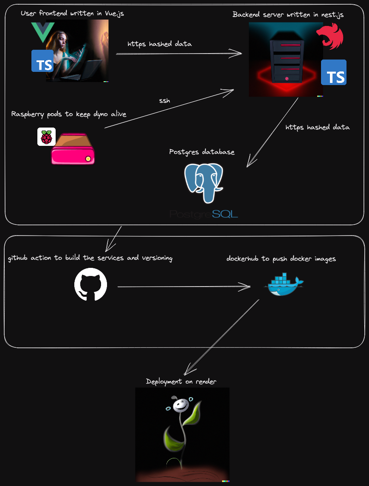

<h2 align="center">Linky-Cloud</h2>

  

Stay organized and never forget important knowledge with linky-cloud.
Store all your links in one secure location and have access to them from any device. No more searching through multiple devices or losing valuable information. With linky-cloud, you can keep all your knowledge at your fingertips, making it easy to stay fully organized and on top of your game. Try it now and take control of your information!

<a href="https://linky-cloud.com">https://linky-cloud.com</a>

 

# Info

Please note that this software is still in beta testing and may contain bugs or have limited functionality. Your feedback and suggestions are greatly appreciated. If you encounter any issues, please report them to [linky-cloud@proton.me](mailto:linky-cloud@proton.me).

# Getting Started

Create an account and start organizing your links with ease. The key to staying organized is to properly categorize your information, add tags to your links, and you'll be able to quickly find exactly what you're looking for, or you can use our ai to find things which you not stored yet.
Ai functionalities will be available from version 2.0.0.

# Architecture

The architecture of linky-cloud, as shared on GitHub, is the intellectual property of Waismayer Fabian (Github: Fabo011). Unauthorized copying, distribution, modification, or any other use of this information is strictly prohibited. The contents of this repository are provided for informational purposes only and are not intended for commercial use. Any use of this information without the express written consent of Waismayer Fabian (Github: Fabo011) is strictly forbidden.

  

# Additional

We use github actions for versioning. For the versions available, see the tags on this repository.
This project is licensed under the MIT License - see the LICENSE file for details.

# Questions

Feel free to reach out to me with any questions or feedback: https://matrix.to/#/#linky-cloud:matrix.org or [linky-cloud@proton.me](mailto:linky-cloud@proton.me).
The matrix chat room is open for everyone. Let´s chat to each other.