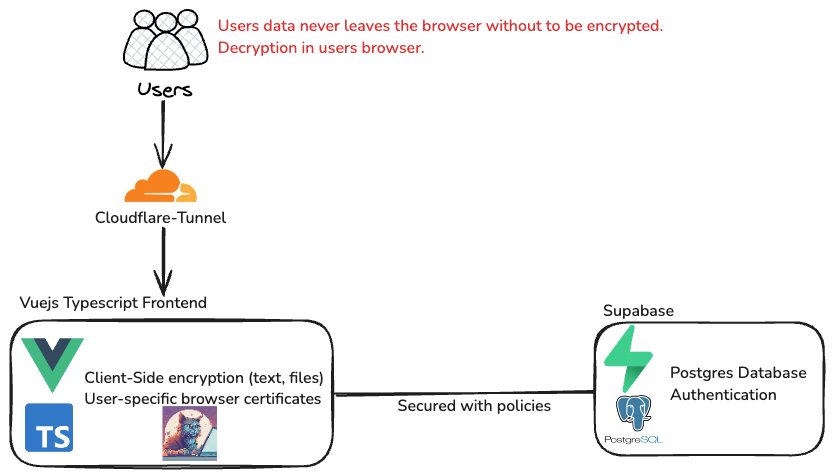

<h2 align="center">Linky-Cloud</h2>

  

Introducing Linky Cloud, the ultimate solution for secure, cloud-based management of your links, contacts, and passwords. The platform ensures that your data remains safe and accessible with state-of-the-art client-side encryption technology. Linky Cloud offers a comprehensive suite of features, including encrypted file uploads for digital and private key backups, making it the perfect choice for individuals and businesses prioritizing security. Trust Linky Cloud to protect your most valuable information with unmatched reliability and convenience.

<a href="https://linkycloud.com">https://linky.fabo011-cloud.de</a>

 

---

 

## Getting Started

Create an account and start organizing your data with ease. The key to staying organized is to properly categorize your information, add tags to your links, and you'll be able to quickly find exactly what you're looking for.

---

 

## Architecture - High Level

  

---

 

## Additional

Github actions are used for versioning. For the versions available, see the tags on this repository.
This project is licensed under the MIT License - see the LICENSE file for details.

---

 

## Questions

Feel free to reach out to me with any questions or feedback: [linky-cloud@proton.me](mailto:linky-cloud@proton.me) or Github-Discussions https://github.com/Fabo011/Linky/discussions.
